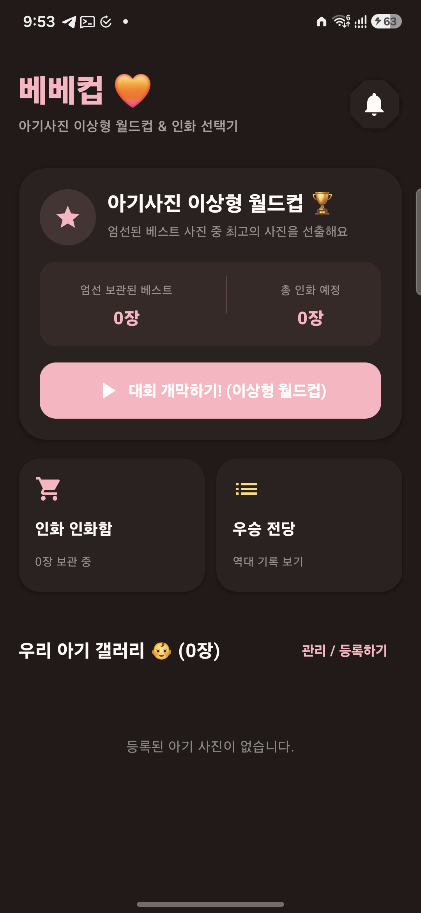
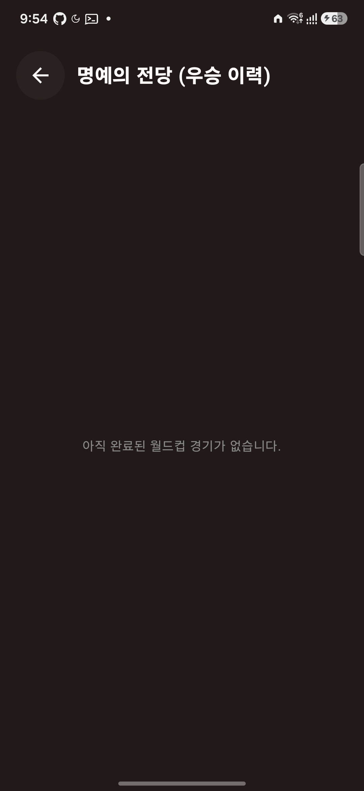

<div align="center">

# 베베컵 · Bebecup

직접 고른 아기 사진으로 만드는 **가족 사진 월드컵**
*A family photo tournament made from baby photos you choose.*

[](https://developer.android.com)
[](app/build.gradle.kts)
[](https://kotlinlang.org)
[](https://developer.android.com/jetpack/compose)
[](#)

[웹사이트](https://jeiel85.github.io/bebecup-android/) ·
[개인정보처리방침](https://jeiel85.github.io/bebecup-android/privacy/) ·
[릴리즈 가이드](docs/RELEASE.md)

</div>

---

## 무엇을 하나요 · What it does

베베컵은 부모와 보호자가 **직접 고른 실제 아기 사진**으로 이상형 월드컵을 만들고, 가족이 함께 인화할 사진을 정리하는 Android 앱입니다.

- 첫 실행 시 목업·샘플 사진을 넣지 않습니다.
- 사진은 Android Photo Picker로 사용자가 직접 선택합니다.
- 선택한 로컬 이미지 URI와 월드컵 기록은 **기기 내부에만** 저장됩니다.
- 외부 인화 사이트는 사용자가 명시적으로 브라우저를 여는 방식으로만 연결됩니다.

## 핵심 기능

| | |
| --- | --- |
| 📷 **사진 후보 관리** | 가족이 직접 고른 아기 사진만 후보로 등록 |
| 🏆 **이상형 월드컵** | 토너먼트로 최고의 한 장을 뽑는 직관적 UI |
| 🖼️ **인화 후보 정리** | 우승 사진과 인화 후보를 따로 모아두기 |
| 🔒 **온디바이스 우선** | 외부 서버 업로드·분석·광고·추적 SDK 없음 |

## 스크린샷

<p>
  
  
</p>

## 기술 스택

- **언어** Kotlin
- **UI** Jetpack Compose · Material 3
- **상태** Lifecycle / ViewModel · Coroutines
- **저장소** Room (KTX)
- **이미지** Coil
- **네트워크** Retrofit · OkHttp · Moshi (외부 인화 사이트 메타 조회용)
- **테스트** JUnit · Robolectric · Roborazzi (스크린샷 회귀)
- **빌드** Android Gradle Plugin · KSP · R8 minify + resource shrinking

| 항목 | 값 |
| --- | --- |
| `applicationId` | `com.bebecup.app` |
| `minSdk` | 24 (Android 7.0) |
| `targetSdk` | 36 |
| `versionName` | 0.2.0 |

## 빌드

[Android Studio](https://developer.android.com/studio)에서 이 디렉터리를 열어 import한 뒤 에뮬레이터나 실제 기기로 실행합니다.

```bash
# Debug
./gradlew :app:assembleDebug

# Unsigned release bundle (검증용)
./gradlew :app:bundleRelease

# Signed release bundle + 데스크톱으로 export
./gradlew :app:exportReleaseToDesktop
```

### 릴리즈 서명

`release-signing.properties`에 다음 값을 설정합니다. 자세한 절차는 [docs/RELEASE.md](docs/RELEASE.md)를 참고하세요.

```properties
BEBECUP_RELEASE_STORE_FILE=.keystore/bebecup-release.p12
BEBECUP_RELEASE_STORE_PASSWORD=...
BEBECUP_RELEASE_KEY_ALIAS=bebecup-release
BEBECUP_RELEASE_KEY_PASSWORD=...
```

> `.keystore/`와 `release-signing.properties`는 `.gitignore`로 커밋이 차단됩니다.

## 디렉터리 구조

```
.
├── app/                       # Android 앱 모듈 (Compose)
├── docs/
│   ├── index.html             # GitHub Pages 랜딩
│   ├── privacy/index.html     # 개인정보처리방침 (공개 URL)
│   ├── RELEASE.md             # 릴리즈 서명/제출 절차
│   ├── PLAY_CONSOLE_INITIAL_REGISTRATION.md
│   └── PRIVACY_POLICY_DRAFT.md
├── fastlane/metadata/android/ # Play Console 메타데이터 (ko-KR, en-US)
│   ├── ko-KR/ ...
│   └── en-US/ ...
├── fastlane/scripts/          # Play Store 그래픽 자산 생성 스크립트
└── .keystore/                 # 업로드 키스토어 (gitignored)
```

## 개인정보 보호

베베컵은 사진 파일, 사진 URI, 사용 기록, 기기 식별자, 위치 정보, 연락처, 계정 정보를 **외부로 전송하지 않습니다**. 자세한 사항은 [개인정보처리방침](https://jeiel85.github.io/bebecup-android/privacy/)에 정리되어 있습니다.

## 문의

- 개발자: **Yongeun Park**
- 이메일: <pedaiah85@gmail.com>

---

<sub>© 2026 Yongeun Park. 모든 권리 보유. 베베컵 · Bebecup is an unaffiliated personal project.</sub>
